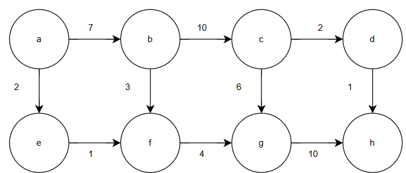
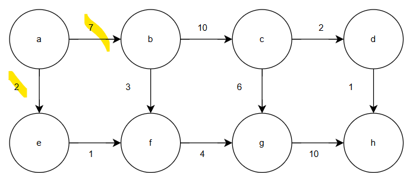
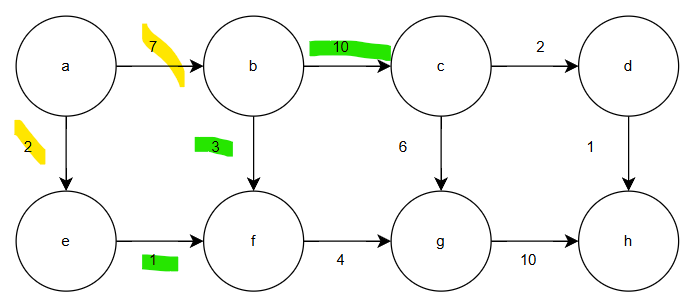
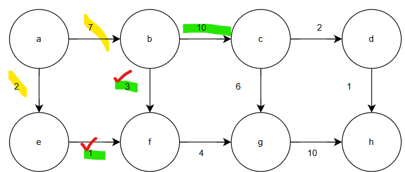
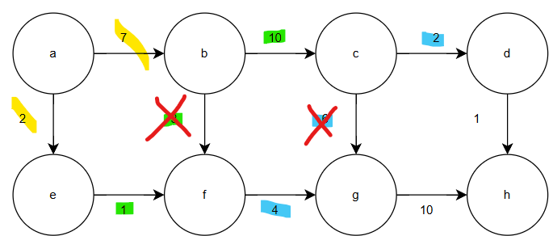
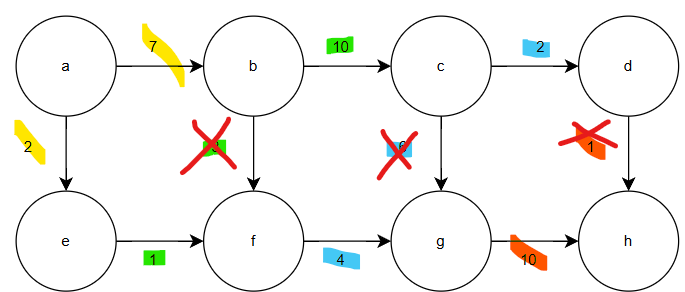

# 다익스트라 알고리즘이란?

사전에서 다음과 같이 한 줄로 정의되고 있다.
> **다익스트라(Dijkstra) 알고리즘**
> "음수 가중치가 없는 그래프에서 특정 시작 정점으로부터 다른 모든 정점까지의 최단 경로를 찾는 그리디(Greedy) 알고리즘"

해당 이미지처럼 생 다익스트라 알고리즘이라면 BFS처럼 모든 노드를 모든 경로로 다 뒤진다. 그냥 BFS에 경로 세는 행위와 같은 것이다.

## 다익스트라 알고리즘의 사용 예시

다익스트라 알고리즘은 최단 거리나 최소 비용이 필요한 거의 모든 실생활 시스템에서 핵심 역할을 한다.

* **네트워크 라우팅**: 데이터 패킷이 목적지 서버까지 가장 빠르게 도착할 수 있는 경로를 설정
* **GPS 내비게이션**: 출발지에서 목적지까지 도로의 가중치를 계산하여 최적의 경로를 안내
* **항공 노선 최적화**: 여러 도시를 거칠 때 비행 거리나 연료 소모를 최소화하는 경로를 파악
* **게임 AI**: 캐릭터가 장애물을 피해 목표 지점까지 가장 효율적으로 이동하는 경로 계산

## 다익스트라 알고리즘의 구성 방식
알고리즘 자체가 그래프와 그리디의 개념을 섞었다. 이 둘을 어떻게 조합하냐에 따라 동작성이 달라진다.
- 그래프 : 최적해를 구할 수 없는 상황이라면 국소적인 해를 DFS로 구성할 수 있고, 보통 BFS를 우선순위큐로 구성해서 최적해를 구함
- 그리디 : 모든 상황에 대한 최적해를 계속 구한다면 무리가 있음. 이때까지 쌓아온 축적값을 이용하는 방식으로 최적해를 확보함. DP 바텀업에서 사용하는 축적값 테이블 활용

## 사진과 함께 보는 다익스트라 동작 과정

a에서 h로 이동할 수 있는 최단거리를 구하는 예제 사진입니다.

directed graph이기에 인접 리스트로 구성된다. a에서 갈 수 있는 노드는 b와 e이다. 

각각 7과 2의 가중치를 갖고 있다. 둘 다 갈 수 있는 길이기에 각 노드의 축적값엔 7과 2가 저장된다.
### 현재 축적값
- b : 7
- e : 2
  

b에선 2개의 길을 갈 수 있고, e에선 f만 갈 수 있다. 
  

b보다 e가 먼저 f로 가는 경우에 예시를 더 다익스트라답게 만들 수 있다.(일반적으로 우선 순위 큐로 구성되기 때문에 실제로 e가 빠르게 구현된다)e가 f로 가는 순간 f에는 3의 축적값이 저장된다. 그리고 b가 f에 도착했을 때 축적값이 10이 되어버리기 때문에 방문조차 하지 않는다. 쓸 데 없는 bfs를 가지치기 해버린 것이다.  

### 현재 축적값
- b,c : 생략
- c : 17
- f : 1

여기도 마찬가지로 g로 가는 축적값이 크기 때문에 앞으로 c에서 g로 가지 않는다.

### 현재 축적값
- d : 19
- g : 7

마지막에 h에 도착한 가장 낮은 축적값인 g->h가 선택되면서 가장 최소 가중치로 경로를 탐색하였다.
### 현재 축적값
- h : 17
  
## 다익스트라 알고리즘의 성능
- 우선순위 큐로 구성할 경우 Edge * log Vertex 라고 한다.
- 참고로 우선순위 큐로 구성하지 않더라도 간선의 수가 굉장히 많다면 bfs보다 성능이 좋다. 

## 여러가지 제약 사항과 이에 대한 해결책
- 가중치에 음수가 들어가는 경우 : 그리디의 조건 자체가 무너진다. 현재까지의 길이 최단 가중치임을 보장할 수 없기에 벨만-포드 간선을 사용해야 한다.(알아볼 것)
- 다중의 출발지에 대한 최단 경로 : 플로이드-워셜보다 성능이 안좋음(알아볼 것)
- 최단 경로가 아닌 적절(?) 경로일 경우 : 휴리스틱 알고리즘을 사용할 것(알아볼 것)