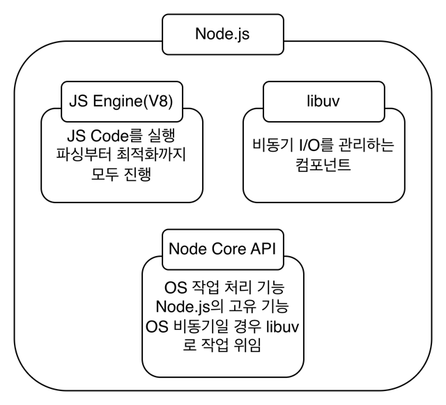
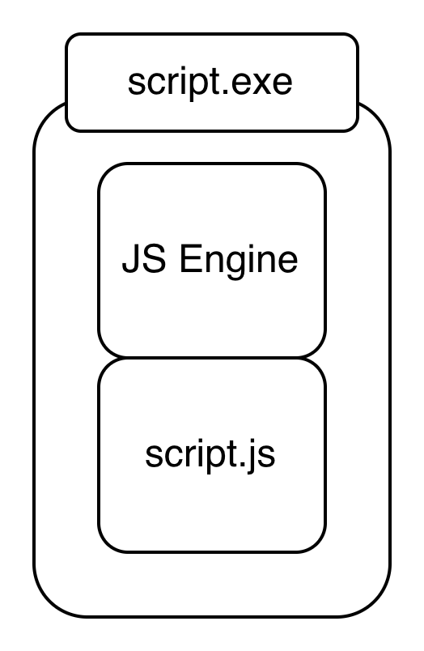

# JavaScript engine과 Node.js
들어가기에 앞서 JavaScript는 Interpreter 언어라는 것을 숙지해야 합니다. JS의 코드를 실시간으로 번역하고 실행시킬 무언가가 존재한다는 것이죠. 그것이 바로 JS engine입니다. 일반적으로 V8 Engine이 사용되는 것으로 보입니다. Chrome과 Node.js에서 사용하고 있습니다. Chrome console에서 JS 파일을 직접 로드할 수도 있고, node 명령어를 통해 JS를 실행할 수 있습니다. 본 포스트에서는 JS Engine으로 널리 사용되는 node 환경으로 진행하겠습니다. node.js == JS 엔진이 실행될 환경이라고 생각해주시면 되겠습니다.

## JS Process lifecycle
JavaScript 파일을 실행하는 법은 여러가지가 있으나 주지했듯이 node.js 환경에서 JS Process lifecycle을 살펴보겠습니다. 먼저 한 눈에 프로세스를 보기 위해 예제를 보여드릴게요.

### 시작 프로세스
시작은 간단하나 컴파일 과정이 섞여 있어서 실행과 따로 정리하도록 하겠습니다.

1. node script.js 명령어 실행
2. Node.js Runtime 환경 구동과 V8 엔진 초기화
3. script.js 코드 파싱(전체 코드를 모두 훑어 봄)
    3.1. Code Hoisting
    3.2. 해당 과정에서 변수, 함수, class 등을 검사하여 prototype 생성
    3.3. Constant Pool(variable, function pointer etc... map) 생성
4. ignition Compile(code to bytecode)진행

* ignition Compile : 필요한 부분까지 인터프리터가 읽기 쉬운 코드로 컴파일 해버리는 방식

### 실행 프로세스
실행 프로세스는 Node.js의 구조를 한 번 보면 이해에 도움이 됩니다.

1. V8이 컴파일된 코드를 인터프리팅
    - 변수나 함수일 경우 위에서 생성된 map 따라서 진행
    - 비동기 코드가 있다면 Node Core API 호출
    - OS 관련 비동기라면 Libuv에 위임
    - 해당 작업들은 Core나 Libuv가 "알아서" 비동기로 처리(방식이 서로 다르고, 복잡하여 정리하지 않음)
    - 처리가 끝날 때 마다 Event Queue에 콜백 쌓임

2. main line 실행 완료(코드 인터프리팅 완료)
    - 비동기 작업 없으면 바로 끝
3. Event Queue에 있는 것들을 V8이 싹 다 실행
4. JS 엔진이 비동기 작업과 Event Queue를 보고 알아서 종료 함

- Libuv : JS Engine이 비동기 프로세스를 실행할 때 사용하는 라이브러리

## JS EXE Build
참고로 script를 모아서 exe파일로 제공하는 방식도 위와 같은 방식으로 동작합니다. 그래서 exe 파일 안에 다음 이미지처럼 JS Engine 자체가 빌드되어 있어서 부피가 제법 큰 편이죠.

사진도 일부로 크게 했습니다.