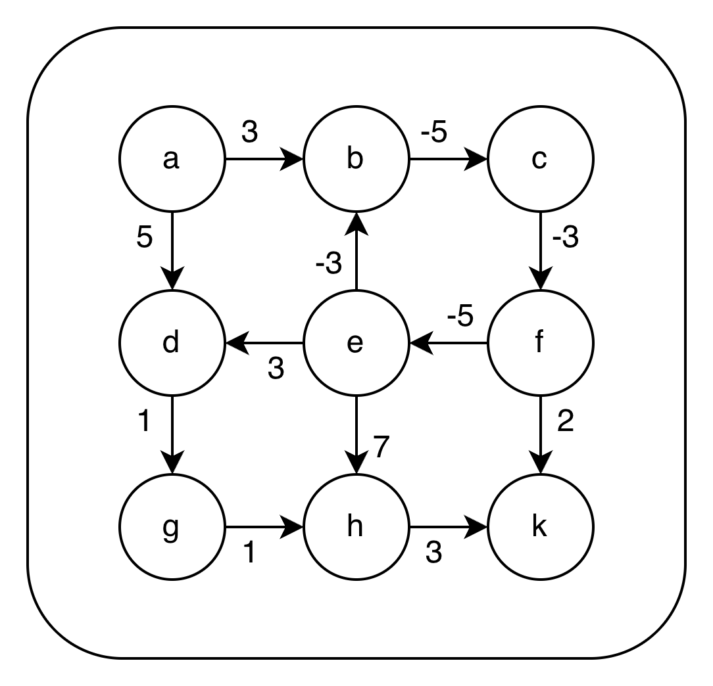
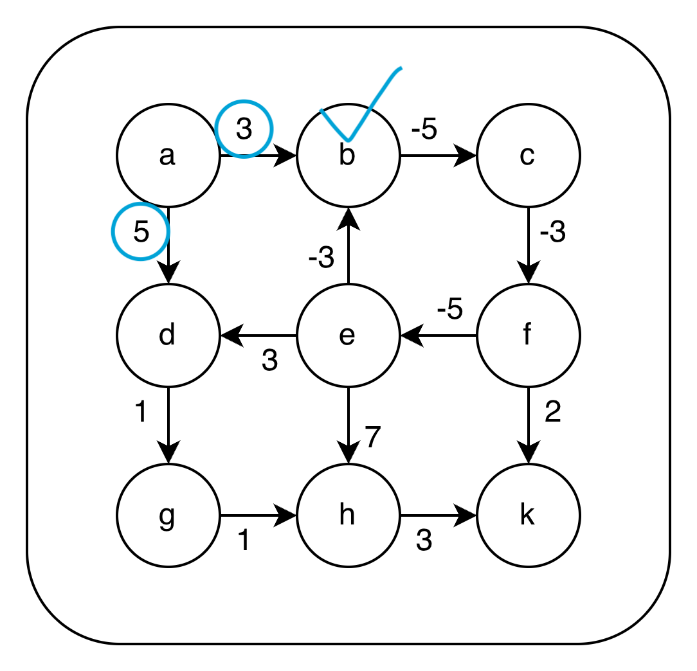
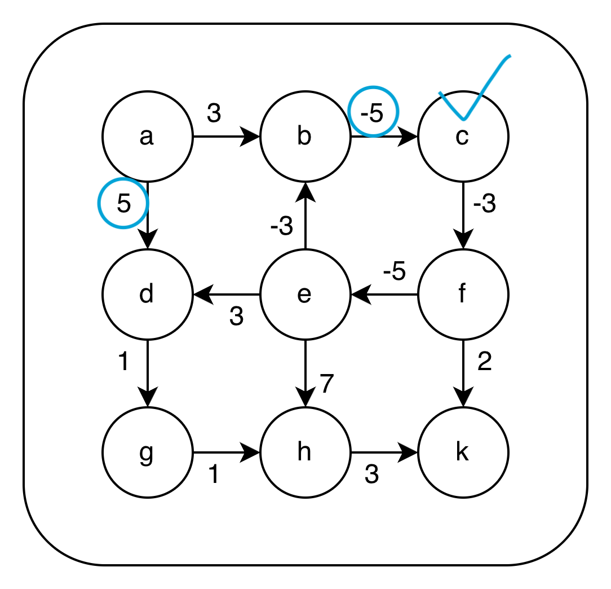
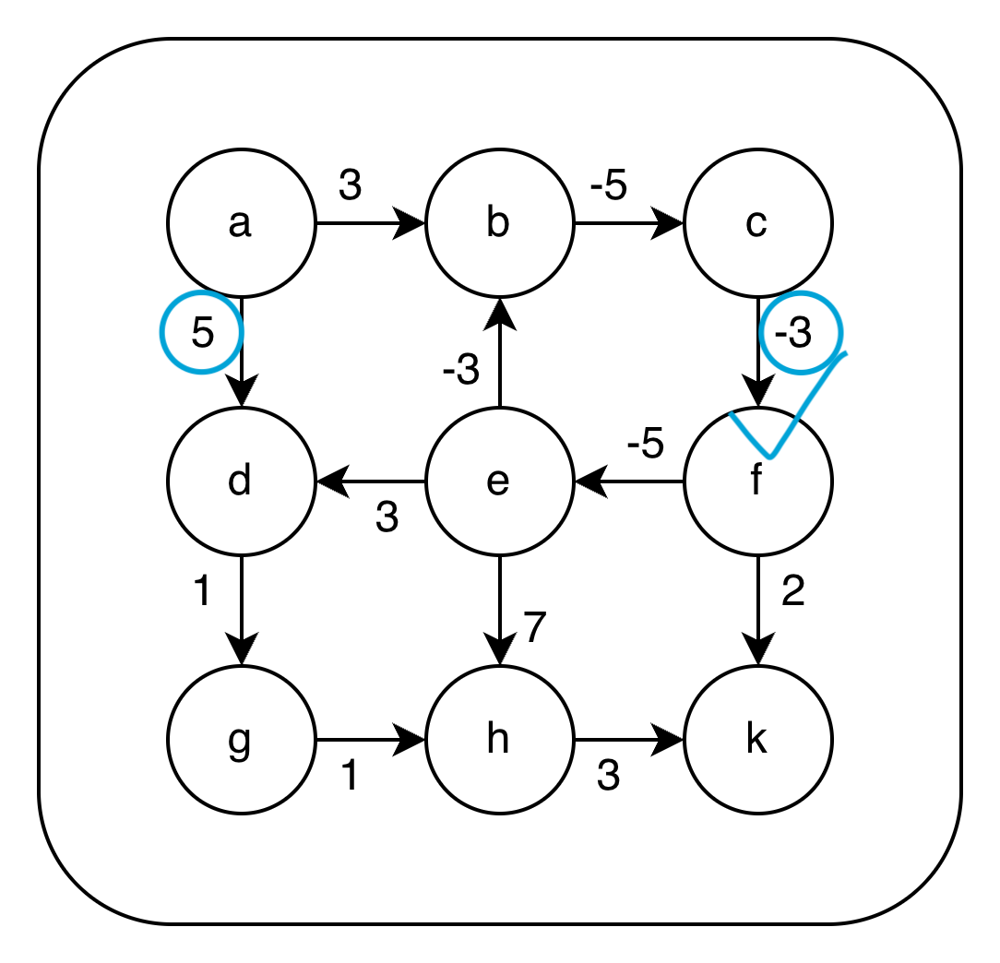
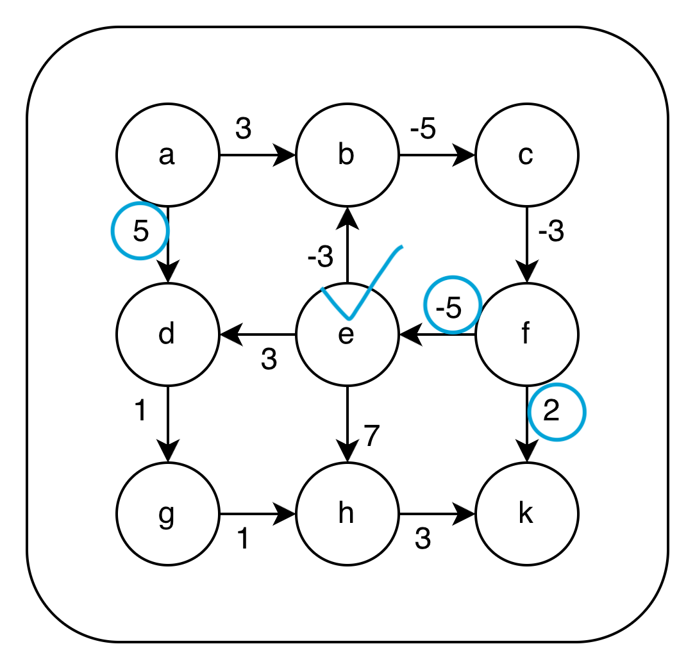
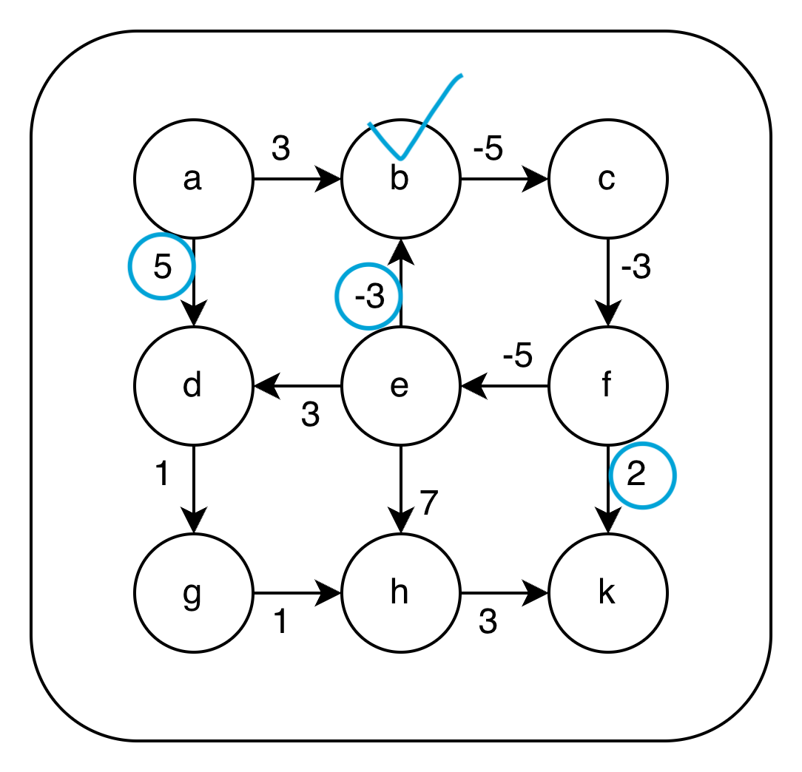
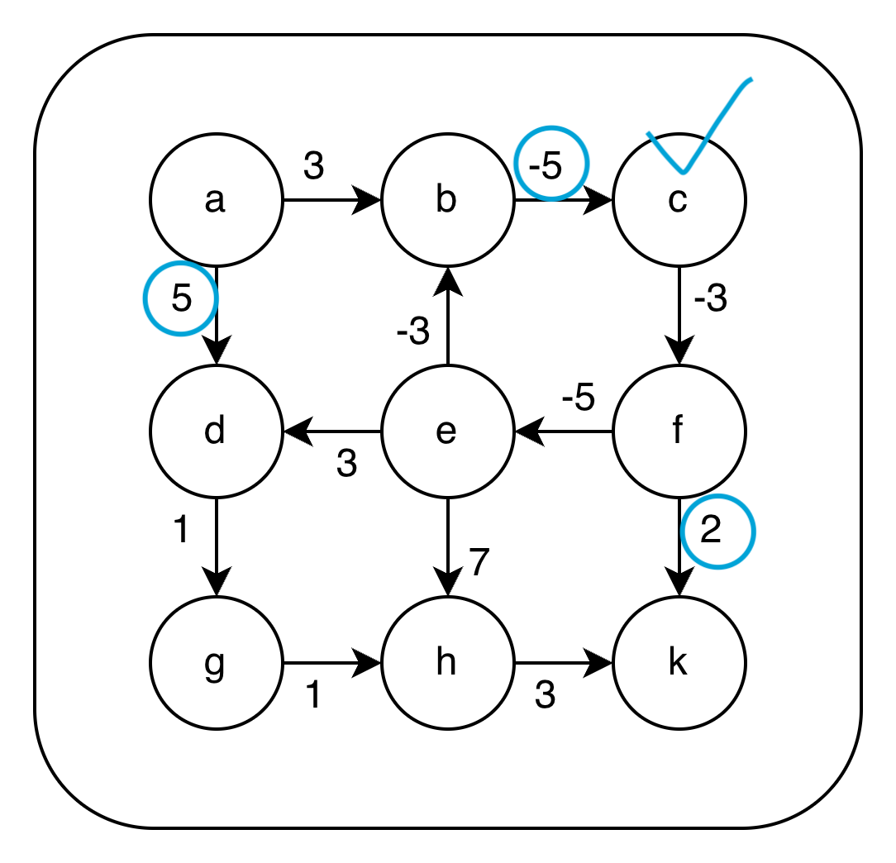

# Dijkstra Alogorithm

다익스트라 알고리즘은 가중치가 부여된 연결 자료구조에서 다른 지점 간의 최소값인 길을 찾는 알고리즘이다.
그러나 몇몇 제한 사항이 있다. 이 제한 사항애 대한 대응이 해당 포스트의 목차가 된다.
1. 음의 가중치가 없어야 한다.
2. 특정 지점을 탐색해야 해도 모든 지점을 탐색하게 된다.
3. 탐색 도중 이전의 경로가 바뀐다면 재탐색을 진행해야 한다.

# 음의 가중치에 대한 대응 벨만-포드 알고리즘
엄밀히 말하면 음의 가중치는 있어도 된다. 길을 찾는데 거리가 아닌 기름이 가중치라고 생각하면, 거리에 주유소가 있는 경우 음의 가중치이다.
그러나 문제는 다익스트라 알고리즘의 그리디 특성 상 이 길을 다중으로 접근할 수 있고, 접근할 때마다 음의 가중치값 때문에 계속 최적으로 판단되어 음의 극한값이 된다.
다음과 같은 가중치 그래프를 보자.

b,c,e,f 노드가 음의 가중치를 가진 엣지로 연결된 그래프이다.
이 그래프에서 a에서 k로 갈 때 가중치를 최소로 하는 길을 찾을 때 다익스트라 알고리즘을 적용해서 확인해보자.
a에서 갈 수 있는 노드는 2가지이고, 가중치가 낮은 b 노드로 가게된다.

현재 queue엔 (b노드:3), (d노드:5) 형태로 저장되어 있다.
그래서 b노드에 연결된 c를 큐에 넣고 우선순위를 판별한다.
당연히 이미 작았던 a-b 가중치에 b-c 음수 가중치로 판별하니 c로 가게 된다.

또 음수 가중치가 나온다. 당연히 d를 무시하고 f로 가게 된다.

f에 오니 노드가 2개 있으니 queue에 추가하자.  

현재 queue엔 (d노드:5) 형태로 저장되어 있다.
우선 순위 큐로 저장된다면 (e노드:-10), (k노드:-3), (d노드:5) 이렇게 d가 맨 뒤로 밀린다.

다행이 아사 직전 e로 오게 되면서 d 노드도 단순한 5가 아니라 -5로 바뀌게 된다.
h도 추가되어야 하는데 일단 넘어가자.

그러나 뜬금없이 방문했던 b로 가게 되는데 그 이유는 b에 접근할 때 가중치가 더 낮은 방법을 찾았기 때문이다.

당연히 c에도 똑같은 로직으로 접근하게 된다...  

이제 평생 b -> c -> f -> e -> b 사이클을 돌면서 음의 극한값을 만들어낸다.

길잡이는 최소값으로 갈 수 있는 목적지를 찾아야 하는 상황에서 3가지 길이 있다.
1. 음의 값 사이클이 있다면 최소값이라는 전제가 무너지기 때문에 그냥 찾지 않는다.
2. 음의 사이클이 있다면 n번만 돈다.

1번 2번 모두 훌륭한 방법이다. 개인적으로 1번이 가장 좋은 방법이나 클라이언트들은 보통 2번을 요구한다.

일단 음의 사이클을 찾는 것이 중요하고 2번을 위해선 어디에 있는지도 중요하다.
이를 위해 벨만-포드 알고리즘이 사용된다.
벨만-포드 알고리즘은 다익스트라 알고리즘과 사뭇 다른 개념을 이용한다.
다익스트라 알고리즘이 그리디 개념으로 버릴 것은 버리자라는 방법이라면 벨만포드 알고리즘은 쌓을 것만 쌓아보자라는 것이다.

단순하게 노드 간의 모든 연결을 더해버리고 그 다음 또 더 해서 음수가 되는 부분을 찾는 것이 포인트이다.

이 그래프는 directed graph이므로 인접 리스트로 나타낼 수 있다.

a -> (b:3), (d:5)
b -> (c:-5)
c -> (f:-3)
d -> (g:1)
e -> (b:-3),(d:3), (h:7)
f -> (e:-5), (k:2)
g -> (h:1)
h -> (k:3)
k -> x

현재 그림으로 그렸을 때 b,c,e,f가 문제라는 것이 보이기 때문

# 특정 지점만 탐색하자 A* 알고리즘

# 이전 경로가 바뀔 수도 있으면 D* 알고리즘