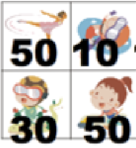
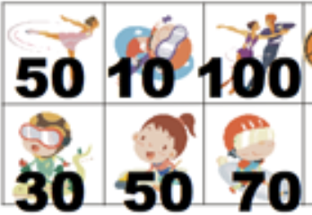

# 백준 9465 스티커
링크 : <a href="https://www.acmicpc.net/problem/9465" target="_blank" rel="noopener noreferrer">https://www.acmicpc.net/problem/9465</a>
## 문제 설명
해당 문제는	변을 공유하지 않는 사각형들을 모은 점수의 최대값을 구하는 문제입니다. DP 문제로 분류되며 연습하기에 좋은 문제입니다.

## 문제 파악 및 풀이 과정
문제를 풀고나서도 여러가지 접근 방법을 생각해봤으나 해당 문제의 풀이 방식은 DP 밖에 없었습니다.
하나의 영역을 골랐을 때 어느 기준점으로부터 해당 영역까지의 최대값이 항상 정해져있습니다.
그러나 그 영역에 하나의 열이 추가되었을 때 겉으로 보기엔 이전값들과 아예 관련없는 답이 나와버립니다.
예를 들어 5개의 열에서 규칙대로 5개를 고르는 방식이 최대값인 스티커가 있다고 합시다. 여기에 1열을 추가했을 때 6개를 고르는게 아니라 오히려 3개만 고르는 방식이 최대값이 될 수도 있는 것입니다. 그래서 그리디가 불가능합니다.  
그래서 DP로 풀기로 했고 다음과 같은 접근 방식으로 점화식을 구할 수 있었습니다.

### 1

이 두개의 영역에선 당연히 2개 중 큰 거 하나만 고르면 됩니다.  
memo[1] = 50

### 2

이 네개의 영역에선 대각선으로 가장 큰 쌍 하나만 고르면 됩니다. 50+50이 30+10보단 크니까 100이겠네요.
memo[2] = 100 

### 3

6개의 영역이 되는 순간 앞선 1과 2에 대한 규칙성과 확연히 달라집니다. 사진 상에서 보이는 듯이 당연히 100이 포함된 지그재그 방식으로 영역을 고르면 되겠으나, 100이 아니라 0이라면 첫 번째 50과 마지막 70을 고른 것이 최적해가 됩니다.  
DP 문제에선 여기가 관건이죠. 문제 설명과 지금까지 나타낸 토대로 점화식을 유도해야 합니다. 3열 기준으로 만들어질 수 있는  케이스를 구하기 위해서 4가지 길이 있습니다.
- 1. 3열의 위 고르고, 2열의 아래 고르기
- 2. 3열의 위 고르고, 1열의 아래 고르기
- 3. 3열의 아래 고르고, 2열의 위 고르기
- 4. 3열의 아래 고르고, 1열의 위 고르기

이 방식으로 오게 된다면 열이 추가될 때마다 최대로 많은 경로룰 선택한 값을 구할 수 있습니다. 즉 해당 경로 중에서 가장 큰 값만 고른다면 최대한 많이 선택한 경로 중에서 최대값만 고르기에 최적해를 구할 수 있습니다.  
이렇게 되면 점화식은 깔끔합니다. 다만 각 열마다 위 아래 두 번 계산해야겠죠.  
m[0][n] = max(m[1][n-1], m[1][n-2])

참고로 처음에 m[0][n-2] 까지 넣었다가 나중에 m[1][n-1]에 중첩된다는 걸 알게 되어 빼기도 했습니다. DP 문제일수록 깔끔해야 정답에 항상 가까운 것 같습니다.

## cpp 풀이
@[code](code1.cpp)
<a href="https://github.com/andoricano/Alg-problem/tree/main/C%2B%2B17/%EB%B0%B1%EC%A4%80/Silver/9465.%E2%80%85%EC%8A%A4%ED%8B%B0%EC%BB%A4"
 target="_blank" rel="noopener noreferrer">cpp code git</a>

## py
@[code](code2.py)
<a href="https://github.com/andoricano/Alg-problem/tree/main/PyPy3/%EB%B0%B1%EC%A4%80/Silver/9465.%E2%80%85%EC%8A%A4%ED%8B%B0%EC%BB%A4" target="_blank" rel="noopener noreferrer">py code git</a>